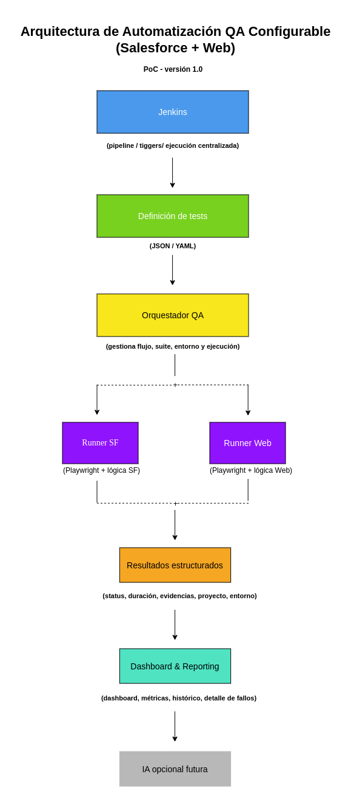

# QA Automation Framework PoC

## 📌 Descripción general

Este proyecto es una Prueba de Concepto (PoC) de un **framework de automatización QA configurable**, diseñado para soportar tanto **Salesforce** como **aplicaciones web**.

El objetivo es construir una solución reutilizable y escalable que permita la ejecución automática de pruebas, la generación de resultados estructurados y una capa de reporting visual personalizada.

---

## 🎯 Problema

En muchos proyectos, la automatización QA se basa en **scripts específicos por proyecto**, lo que provoca:

* Baja reutilización
* Alto coste de mantenimiento
* Falta de visibilidad centralizada
* Capacidades limitadas de reporting

Además, herramientas tradicionales basadas en reportes HTML estáticos no ofrecen la flexibilidad necesaria para evolucionar con las necesidades del proyecto.

---

## 💡 Solución propuesta

Esta PoC propone un **framework de automatización configurable**, donde:

* Los tests se definen de forma declarativa (no hardcodeados)
* Existe una capa de ejecución unificada para distintos entornos (Salesforce y Web)
* Los resultados se almacenan en formato estructurado
* Se implementa una capa de reporting visual personalizada

La arquitectura está diseñada para permitir futuras extensiones, como generación de tests asistida por IA o análisis automático de resultados.

---

## 🏗️ Arquitectura

  

---

## 🔄 Flujo de ejecución

1. Se cargan las definiciones de tests desde archivos de configuración
2. El orquestador QA determina el contexto de ejecución (Salesforce o Web)
3. Los runners basados en Playwright ejecutan las pruebas
4. Se generan resultados en formato estructurado
5. La capa de reporting procesa y visualiza los resultados

---

## ⚙️ Stack tecnológico (previsto)

* Jenkins (orquestación CI/CD)
* Playwright (ejecución de tests)
* Node.js / Python (por definir)
* Capa de reporting custom (por definir)
* Docker (contenedorización)

---

## 🚧 Estado del proyecto

El proyecto se encuentra actualmente en fase de **diseño e inicialización**.

Próximos pasos:

* Configuración de la estructura del repositorio
* Inicialización de Jenkins en contenedor
* Primera ejecución de tests (Web)
* Implementación inicial del reporting

---

## 📌 Notas

Esta PoC está diseñada con una arquitectura **modular y extensible**, permitiendo incorporar en el futuro capacidades como generación de tests mediante IA o análisis avanzado de resultados.

## 👩‍💻 Autor

Hecho con ❤️ por Melissa Melendez · DevOps & Cloud